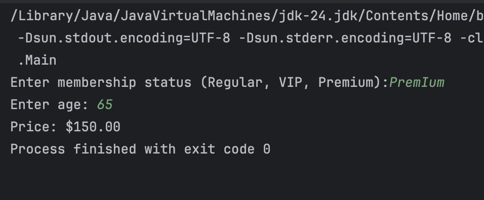

# Lab 2: Membership Gym Price Calculator

Submitted by: Christopher Bayquen | June 30, 2025

This repository holds our submission for our Second Lab Activity in our Java Fundmentals Session. This activity tasked us to create a simple Gym Price calculator given a few user input parameters: Gym Membership Status and Age.

### Input/Output :

### Output Test Validation :

### Sample Output :

